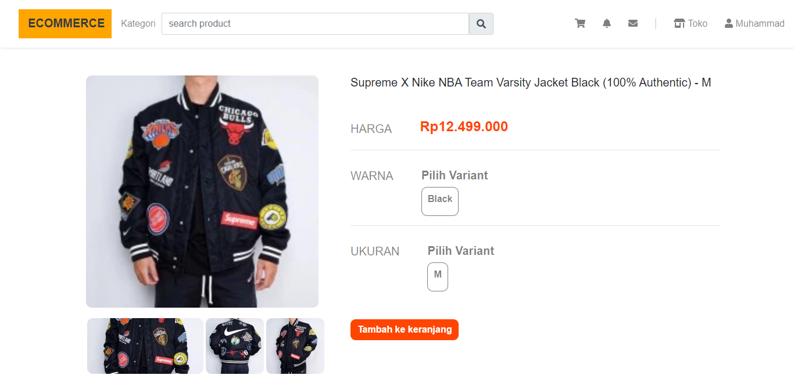
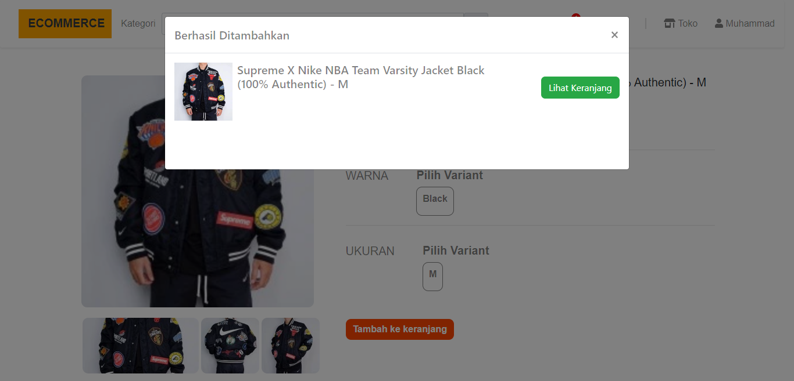
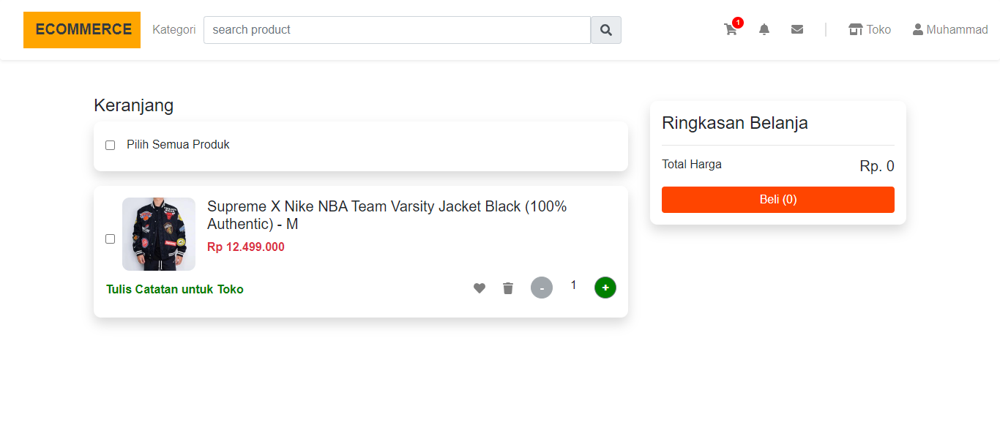

# Simple E-commerce React Redux
## Requirements
* **[`react`](https://reactjs.org)**
* **[`redux`](https://redux.js.org)**
* **[`reactstrap`](https://reactstrap.github.io/)**

## Getting started
Clone the repository
```
git clone https://github.com/sjasminetya/e-commerce-react.git
```
Install all dependencies
```
npm install
```

## Screenshots
<div class="flex" align="center">
  
  
  
  
</div>
